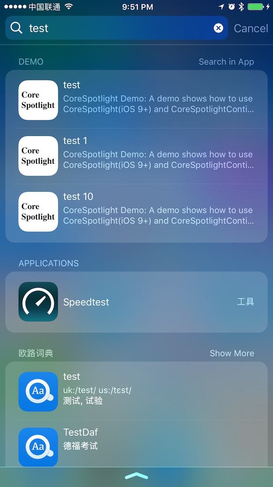

# Core-Spotlight-Demo
    

A demo shows how to use CoreSpotlight(iOS 9+) and CoreSpotlightContinuation(iOS 10+) API.

# CoreSpotlight
CoreSpotlight lets you search In-app contents in Spotlight.

# CoreSpotlightContinuation
CoreSpotlightContinuation lets you continue searching in App from Spotlight.

# Installation
Just git clone & Run

# Requirements
This project requires `iOS 10.0+` and `Xcode 8.0+`.

# Screenshot

